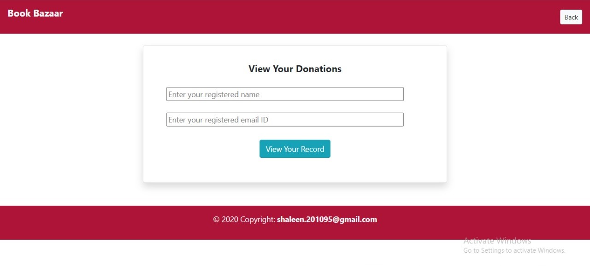

# BookBazaar
An online book donation java web app is a "home pick-up solution" used to donate unused books to rural,and financially unstable children of the country.
This book donation portal works in collaboration with some concerned NGOs.

